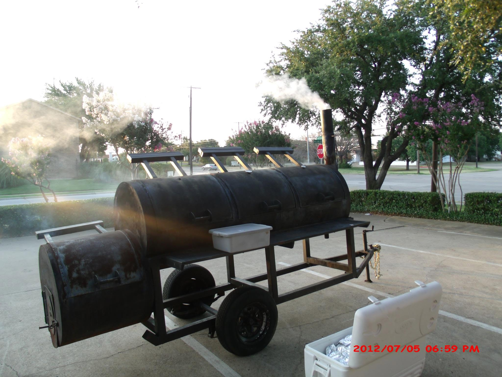

# South East Texas BBQ & Catering



A mobile-first catering website for **South East Texas BBQ & Catering**.

**Live website:** https://westberglabs.github.io/set-bbq-website/

---

## What this project does

Customers can:

- Browse the menu and pricing
- Build a catering request
- Choose quantities and menu options
- Request delivery
- Add special requests
- Request a custom dessert starting at $40
- Submit an order
- Receive a confirmation email
- Receive a PDF copy of the order

When an order is submitted:

1. The business receives the full order by email.
2. The customer receives a confirmation email.
3. The PDF invoice is generated in the browser.
4. The business email's **Reply-To** is set to the customer.
5. The business email also provides the current SMS notification workflow through Verizon email-to-text.

The website itself is **static**. There is currently no database or server-side application.

---

## Repository

**GitHub:** https://github.com/WestbergLabs/set-bbq-website

### Branches

| Branch | Purpose |
|---|---|
| `main` | Production / GitHub Pages |
| `emailjs-rebuild` | Development and testing |

Keep `emailjs-rebuild`. Use it for future changes, test thoroughly, then move approved changes to `main`.

---

## Project structure

```text
/
├── index.html              # Home
├── menu.html               # Menu
├── catering.html           # Catering information
├── order.html              # Customer order form
├── contact.html            # Contact information
│
├── data/
│   ├── menu.json           # Menu names, descriptions, options
│   └── prices.json         # Prices and delivery fee
│
├── css/
│   └── style.css           # Shared site styling
│
├── js/
│   ├── order.js            # Order form, options, totals
│   ├── custom-dessert.js   # Custom dessert handling
│   ├── email-order-v2.js   # Email/PDF/order submission
│   ├── emailjs-config.js   # EmailJS configuration
│   ├── site-version.js     # Visible build version
│   └── ...                 # Supporting order/PDF scripts
│
├── images/
│   ├── logo/               # Site logos
│   └── hero/               # Hero imagery
│
└── docs/
    └── EMAILJS_SETUP.md    # EmailJS setup reference
```

There are several small order-related JavaScript files because the order system was built incrementally. **Do not combine, rename, or remove them casually.** Check `order.html` before changing script names or load order.

---

# Changing menu items and prices

Menu content and pricing are intentionally separated from the main application.

### Change a price

Open:

```text
data/prices.json
```

Find the item's price key and change its `basePrice`.

Example:

```json
"brisket": { "basePrice": 155 }
```

Change only the number:

```json
"brisket": { "basePrice": 165 }
```

### Change a menu item

Open:

```text
data/menu.json
```

You can change:

- Name
- Description
- Unit/size wording
- Options
- Pricing reference

**Important:** Keep the item's `priceKey` matched to `data/prices.json`.

If an item is renamed or removed, search the JavaScript files for its ID before deleting anything.

### Desserts

Customer-facing dessert names intentionally do **not** use unexplained "pan" terminology.

Current special dessert behavior includes:

- Banana Pudding — Full Size
- Banana Pudding — All Biscotti
- Banana Pudding — Half & Half
- Small Mason Jar pudding
- Custom Dessert — Starting at $40

Custom desserts are **starting-price requests**, not guaranteed final prices. Someone will contact the customer to discuss the request and final pricing.

---


## Menu & Pricing Manager

A simple browser-based editor is available for menu and pricing changes:

**Menu & Pricing Manager:** https://westberglabs.github.io/set-bbq-website/tools/menu-manager.html

It loads the current `menu.json` and `prices.json` and presents the editable information as a table. You can change:

- Item names
- Descriptions
- Unit/size wording
- Base prices
- Customer-facing options
- Option price adjustments
- Delivery fee

The editor intentionally hides internal item IDs so normal menu maintenance is easier and safer.

### Important: how saving works

The editor is a **static GitHub Pages tool**, so it cannot write directly back to the repository. After editing:

1. Download `menu.json` and/or `prices.json`.
2. Replace the matching file in the repository's `data/` folder.
3. Test the order form.
4. Commit the change to the development branch first when practical.
5. Move the tested change to `main`.

Do not use the editor to change special logic or internal IDs. Those remain in the application code.

The manager is especially useful for routine price and wording changes; it does not replace testing after changes.

# Email system

Email is handled by **EmailJS**. Supabase or another database is **not** involved in sending email.

The site sends:

- **Business order email**
- **Customer confirmation email**

The business order uses the customer's email as **Reply-To**.

The PDF invoice is generated in the browser with PDF-Lib and attached to the emails.

### EmailJS configuration

Website configuration:

```text
js/emailjs-config.js
```

EmailJS templates currently used:

- `set_bbq_business_order`
- `set_bbq_customer_confirm`

The business and customer sends intentionally use their configured services. Do not change the working routing without testing both emails.

See:

```text
docs/EMAILJS_SETUP.md
```

for the setup reference.

### SMS notification

The current order alert uses the existing **business email → Verizon email-to-text** workflow.

It is intentionally just an alert to check the business email rather than a second copy of the complete order.

If this changes later, document the new workflow here before changing production code.

---

# External services and websites

| Service | Purpose | Website |
|---|---|---|
| **GitHub** | Source code and version control | https://github.com/ |
| **GitHub Pages** | Hosts the production website | https://pages.github.com/ |
| **EmailJS** | Sends business and customer emails | https://www.emailjs.com/ |
| **Verizon** | Current SMS/email-to-text notification path | https://www.verizon.com/ |
| **jsDelivr** | Loads browser libraries | https://www.jsdelivr.com/ |
| **PDF-Lib** | Generates PDF invoices in the browser | https://pdf-lib.js.org/ |

### Email accounts used by the workflow

- **Yahoo** — business/customer email mailbox
- **Gmail** — current sending service used for business-order email routing
- **Verizon** — SMS notification delivery

These are part of the operational workflow; they are not application databases.

---

# Order form

The order form is primarily handled by:

### `js/order.js`

Responsible for:

- Loading menu/pricing data
- Rendering menu categories
- Quantities
- Options
- Split options
- Validation
- Order summary
- Totals

### `js/custom-dessert.js`

Responsible for:

- Custom Dessert UI
- Customer's custom description
- Including the custom request with the order

### `js/email-order-v2.js`

Responsible for:

- Building the order
- Generating the order number
- Building email HTML
- Generating the PDF
- Sending the emails
- Customer confirmation

### PDF

The invoice is generated in the browser using PDF-Lib.

The email and PDF are built from the same order data so quantities, options, item names, and totals stay synchronized.

---

# Testing

For local testing:

```bash
python -m http.server 8000
```

Then open:

```text
http://localhost:8000
```

### Basic production test

Before moving a significant order-form change to `main`, verify:

- Home page
- Menu page
- Catering page
- Contact page
- Order page on desktop
- Order page on mobile
- Empty-order validation
- Quantities
- Menu options
- Brisket options
- Pork belly options
- Wings options
- Baked Beans options
- Banana Pudding All Biscotti
- Banana Pudding Half & Half
- Small Mason Jar
- Custom Dessert
- Delivery fee
- Special requests
- Correct total
- Business email
- Customer confirmation
- PDF invoice
- Business email Reply-To → customer

For a Custom Dessert order, confirm the request appears in the:

- Business email
- Customer email
- PDF

---

# Versioning

The site displays its current build version in the footer.

Version file:

```text
js/site-version.js
```

For meaningful production changes:

1. Update the site version.
2. Check any changed script cache-busting query strings in `order.html`.
3. Test the affected workflow.

The current production version is **v0.1.16**.

---

# Future database

A database is **not currently part of production**.

If a database is added later, it should be treated as a **data layer only**:

```text
Customer
   ↓
Website
   ├── Database → order records
   └── EmailJS → email notifications
                    ↓
                 Verizon
                    ↓
                 SMS alert
```

Do not reintroduce database/email responsibilities into the website unless there is a specific reason to do so.

---

# Future changes

Recommended workflow:

1. Start on `emailjs-rebuild`.
2. Make the smallest necessary change.
3. Test locally.
4. Test the affected page on mobile and desktop.
5. For order changes, submit a complete test order.
6. Verify business email, customer email, PDF, and SMS alert when applicable.
7. Update the version.
8. Move the approved change to `main`.
9. Leave `emailjs-rebuild` available for the next change.

**Keep the site simple.** Avoid adding infrastructure unless the business actually needs it.
